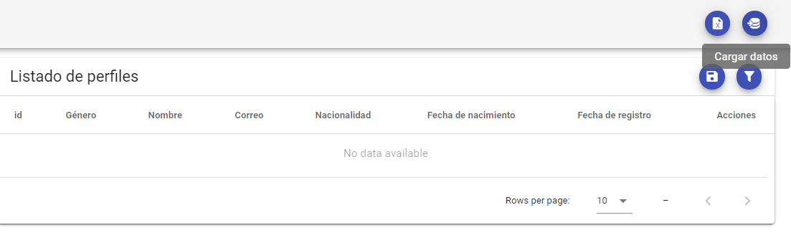
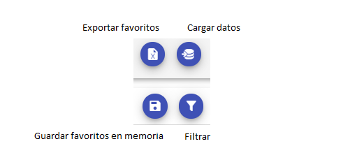
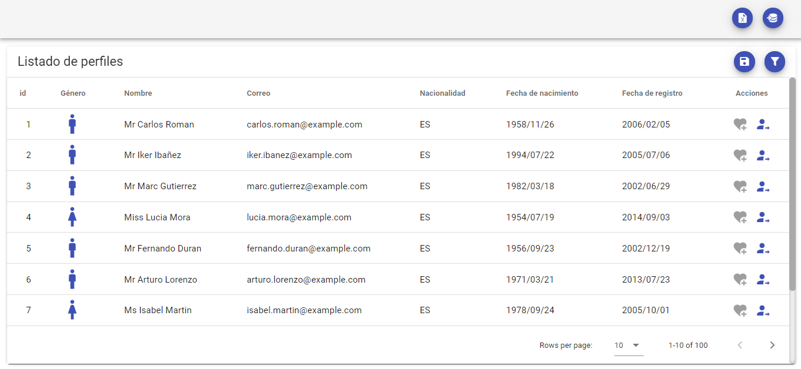
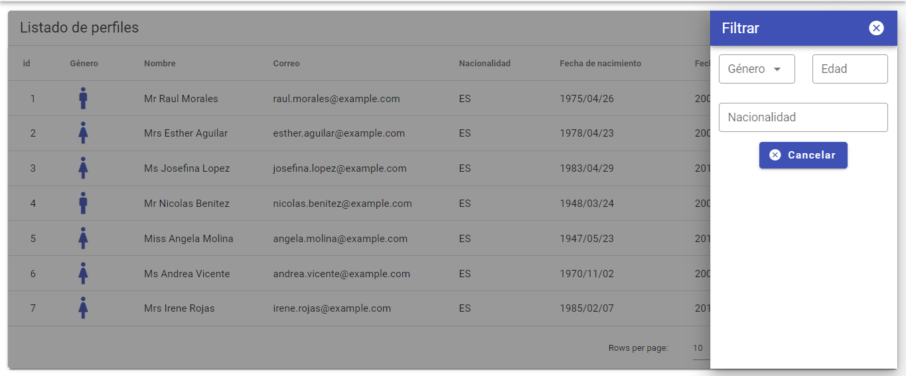
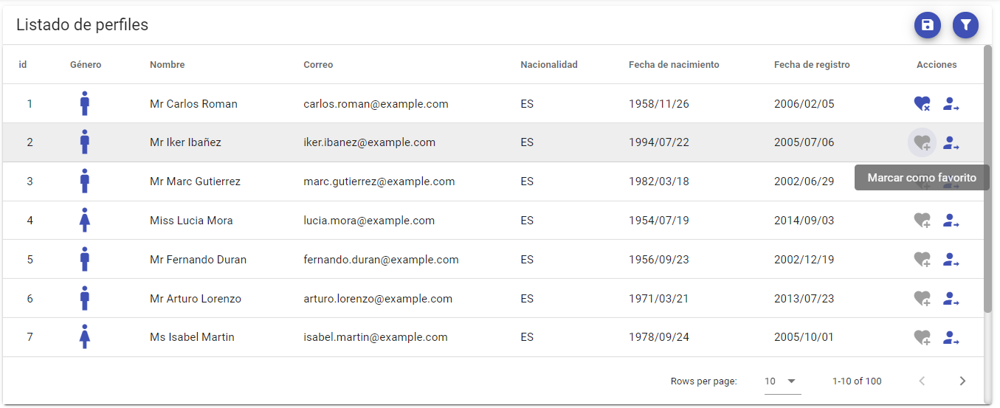
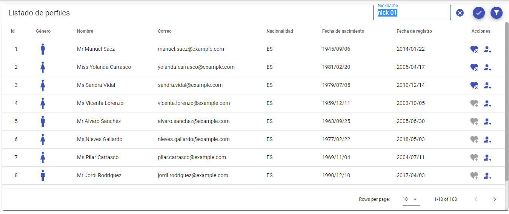
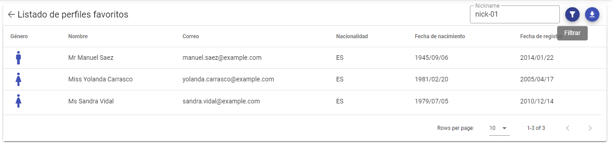
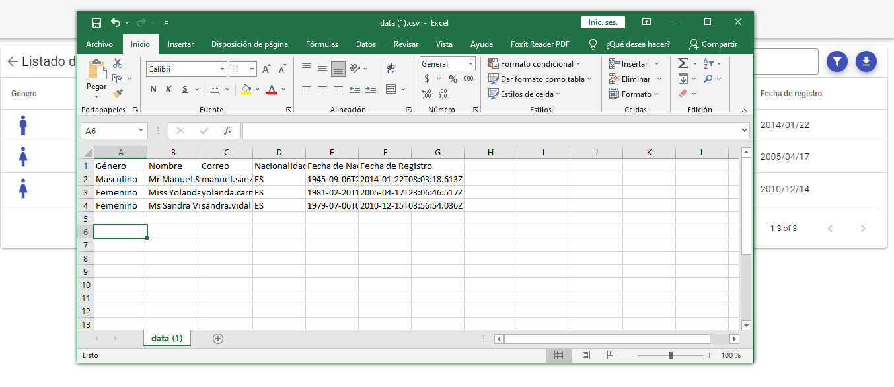
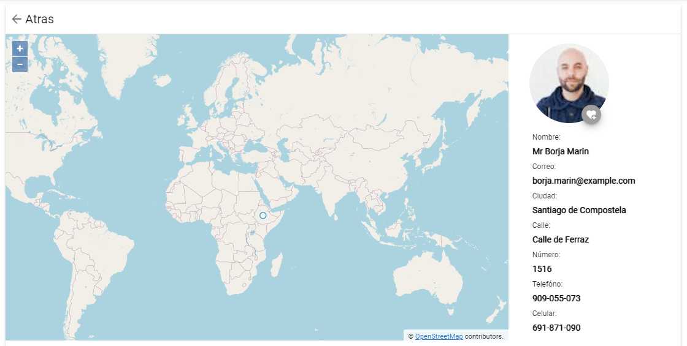

# favorite-user-profiles-front
App vuejs para gestionar perfiles de usuarios favoritos mediante el consumo de la API Random User y el microservicio "favortie-user-profiles-backend".

## Despliegue
1- Instalar dependencias del proyecto mediante el comando:
    ```
    npm install
    ```
    
2- Correr el proyecto
    ```
    npm run serve
    ```
    
3- Compilar proyecto
    ```
    npm run build
    ```

## Restricciones del ejercicio
1- Primeramente deberá importar los perfiles mediante la opción "Cargar datos"



y sobre los datos podrá realizar las siguientes acciones



2- Al "Cargar datos" se presentarán como máximo 100 perfiles



3- Al "Filtrar" los perfiles consultados podrán ser filtrados por: género, edad y nacionalidad



4- Los perfiles podrán ser marcados como favoritos mediante la opción "Marcar como favorito"



Luego de marcar uno o varios perfiles como favoritos.
 Al seleccionar "Guardar favoritos en memoria" se consume del microservicio para salvar la lista en memoria con el nickname proporcionado por el usuario.
 
 
 
5- Las listas guardadas podrán ser consultadas mediante la opción "Exportar favoritos" 

Filtrar por nickaname la lista que desea buscar


Los perfiles favoritos filtrados podrán ser exportados meidante la opción "Exportar"


6- La app permite seleccionar un perfil y mostrarlo en otra vista




